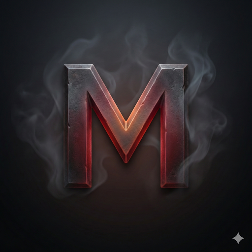

# Mettle

A character creation and management tool for the **Draw Steel** TTRPG by MCDM Productions.



## Features

- **All 10 Hero Classes** - Full support for Censor, Conduit, Elementalist, Fury, Null, Shadow, Summoner, Tactician, Talent, and Troubadour
- **Character Creation Wizard** - Guided step-by-step character building with ancestry, culture, career, and class selection
- **Combat Tracker** - Track stamina, conditions, heroic resources, and abilities during play
- **Minion Management** - Full summoner support with squads, formations, and champion tracking
- **Level-Up Progression** - Manage character advancement with ability and feature choices
- **Offline Support** - Works entirely offline with JSON export/import for character data
- **Themes** - Multiple visual themes to customize your experience

## Installation

### Download

Download the latest release for your platform:
- **macOS**: `Mettle_x.x.x_universal.dmg` (Universal binary for Intel and Apple Silicon)
- **Windows**: `Mettle_x.x.x_x64-setup.exe`

### Build from Source

```bash
# Clone the repository
git clone https://github.com/yourusername/mettle.git
cd mettle

# Install dependencies
npm install

# Run in development mode
npm run dev           # Web only
npm run tauri:dev     # With native window

# Build for production
npm run tauri:build:mac   # macOS universal binary
npm run tauri:build:win   # Windows
```

## Tech Stack

- **React 19** + TypeScript + Vite
- **Tauri 2.x** for native desktop builds
- **Tailwind CSS** + Radix UI + shadcn/ui
- **Motion** (Framer Motion) for animations

## Game Data

Mettle uses authoritative Draw Steel game data from the official rules. All game mechanics, abilities, and features are sourced from:
- **JSON data files** for abilities, features, and monsters
- **Markdown rules** for ancestries, careers, kits, and core mechanics

## License

This project is licensed under the **GPL-3.0** license - see the [LICENSE](LICENSE) file for details.

Mettle is a fork of [Forge Steel](https://github.com/andyaiken/forgesteel) by Andy Aiken.

## Acknowledgments

- [MCDM Productions](https://mcdm.gg/) for creating Draw Steel
- [Andy Aiken](https://github.com/andyaiken) for the original Forge Steel project
- The Draw Steel community for feedback and support

## Contributing

Contributions are welcome! Please feel free to submit issues and pull requests.
